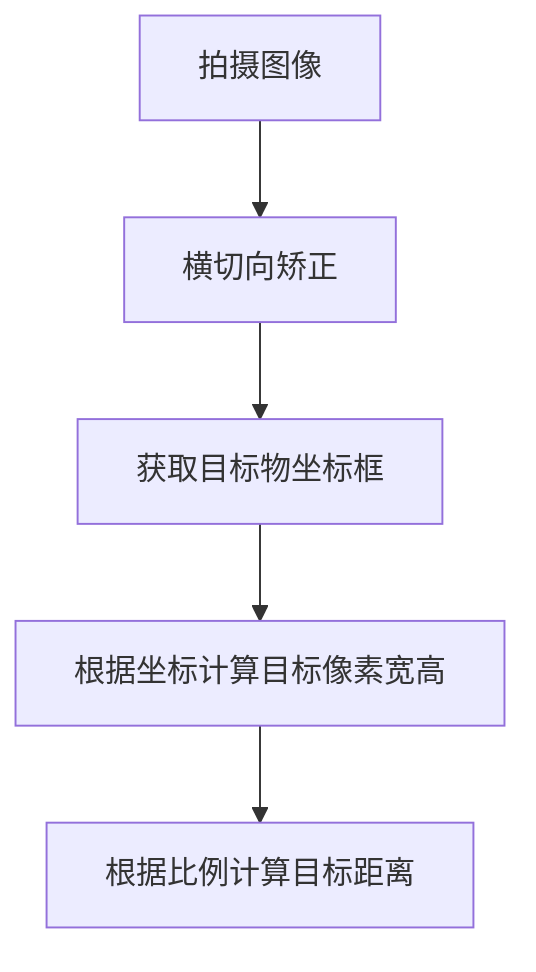

# OneEyeDistance
**整体实验步骤：**

在Config中填写张氏标定获取的参数：\
1. 相机内参 
2. 相机畸变系数矩阵，5*1矩阵(k1,k2,p1,p2,k3)\

函数CorrectImage 作用：矫正图像，将获取到的图像经过cv矫正后再进行测距工作\
函数FindCoin 作用：霍夫检测圆，调节好检测灵敏度，最佳状态是拟合圆正好是目标圆的周长

注意事项：
在标定时配置图像的大小需要同你检测时候使用的视频画面同等大小，不然检测距离的时候会不准
